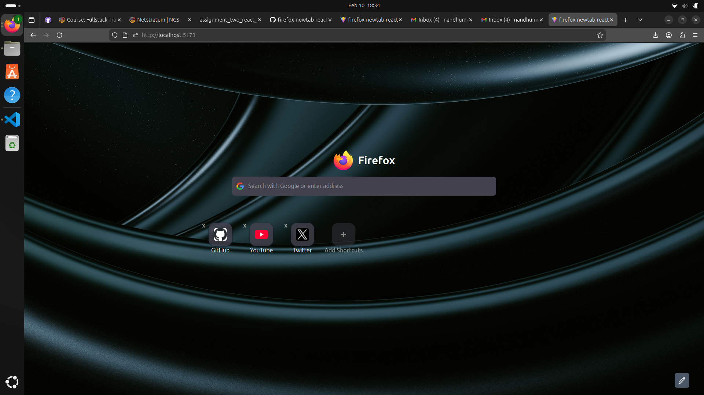
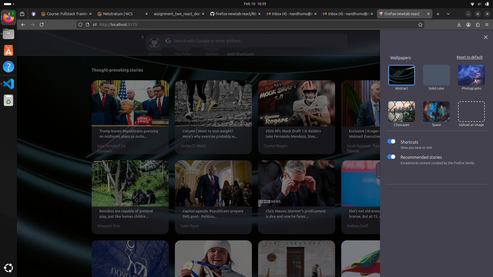

# Firefox New Tab React

A Firefox-inspired **new tab homepage** built using **React, TypeScript, Vite, Tailwind CSS and Shadcn/ui**.  
The app allows users to customize shortcuts, wallpapers, and view recommended news stories.

---

## Project Overview

This project recreates the core experience of Firefox’s New Tab page with customization features.

### Features
- Google-style search bar
- Website shortcuts with favicons
- Add & remove shortcuts (saved using Local Storage)
- Custom background wallpapers
- Toggle shortcuts and recommended stories
- News fetched using NewsAPI
- Responsive layout across screen sizes

---

## Setup & Run Instructions

### Prerequisites
- Node.js (v18 or later recommended)
- npm or yarn
- NewsAPI key

---

### Clone the Repository

```bash
git clone https://github.com/your-username/firefox-newtab-react.git
cd firefox-newtab-react
```

### Install Dependencies

```bash
yarn install
```

### Environment Configuration

Create a .env file in the project root:

```bash
VITE_NEWS_API_KEY=your_news_api_key_here
```
Get your API key from:
https://newsapi.org/

### Run the Application

```bash
yarn dev
```

### Folder Structure

```bash
src/
├── assets/
│   └── images/
│       ├── bg1.jpg
│       ├── city.jpg
│       ├── space.jpg
│       └── icons & logos
│
├── components/
│   ├── SideSheet.tsx        # Settings sidebar
│   ├── AddShortcuts.tsx    # Add shortcut dialog
│   └── ui/                 # Reusable UI components
│
├── App.tsx                 # Main app logic
├── App.css                 # Global styles
├── main.tsx                # Entry point
│
├── index.css               # Tailwind base styles
└── vite-env.d.ts

```

### Technologies Used

- React + TypeScript
- Vite
- Tailwind CSS
- Axios
- NewsAPI
- shadcn/ui components

---

## Screenshots

### Home Page


### News & Stories


### Settings / Customization Panel



